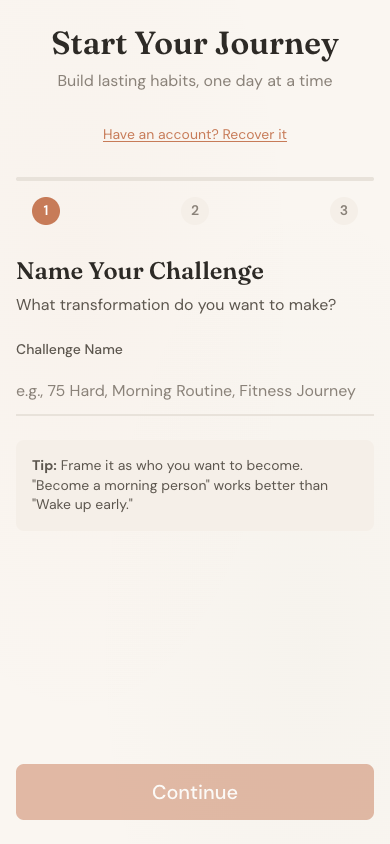

# Habit Build

A browser-based habit tracking app for building lasting habits through daily check-ins and visual streak tracking.

<p align="center">
  
</p>

## Features

- **Daily Check-ins** - One-tap tracking for your daily habits
- **Visual Streak Calendar** - "Don't break the chain" calendar view
- **66-Day Challenges** - Based on habit science research (not the 21-day myth)
- **Strict Mode** - Optional hardcore mode where missing any day resets progress
- **Cloud Sync** - Data syncs across devices when logged in
- **Offline Support** - Works offline after first load
- **Friends & Feed** - Share progress with friends and see their activity
- **Recovery Phrase** - 12-word phrase to recover your account

## Tech Stack

- **Frontend**: [Astro](https://astro.build/) with vanilla TypeScript
- **Styling**: CSS with custom design system (warm/organic aesthetic)
- **Storage**: localStorage (local) + Cloudflare D1 (cloud sync)
- **Deployment**: [Cloudflare Pages](https://pages.cloudflare.com/) + Cloudflare Functions
- **Package Manager**: [Bun](https://bun.sh/)
- **Dependencies**: Zero runtime dependencies

## Getting Started

### Prerequisites

- [Bun](https://bun.sh/) 1.3.x or later

### Installation

```bash
# Clone the repository
git clone https://github.com/kubre/habit-builder.git
cd habit-builder

# Install dependencies
bun install

# Start development server
bun run dev
```

### Commands

| Command | Description |
|---------|-------------|
| `bun run dev` | Start development server at localhost:4321 |
| `bun run build` | Build for production |
| `bun run preview` | Preview production build locally |
| `bun run deploy` | Deploy to Cloudflare Pages |

## Design Philosophy

Based on habit science research from UCL and James Clear's *Atomic Habits*:

- **66-day default** - Average time for habit formation (not 21 days)
- **Never miss twice** - Missing one day doesn't break habit formation
- **Visual chain** - "Don't break the chain" calendar motivates consistency
- **Minimal friction** - Maximum 2 taps to complete daily check-in

## License

MIT

## Live Demo

[habit-build.pages.dev](https://habit-build.pages.dev)
